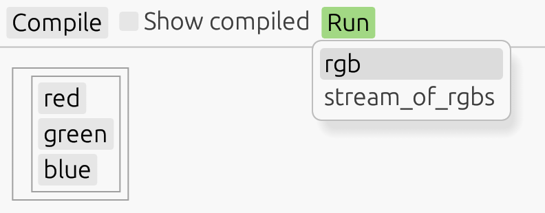
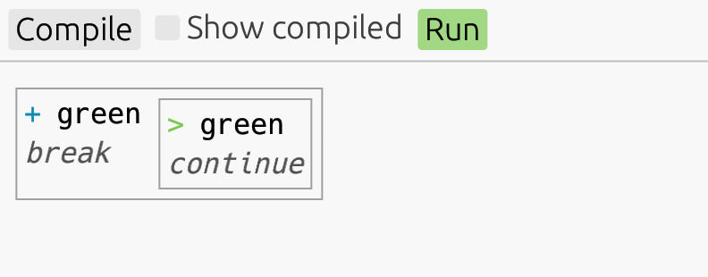
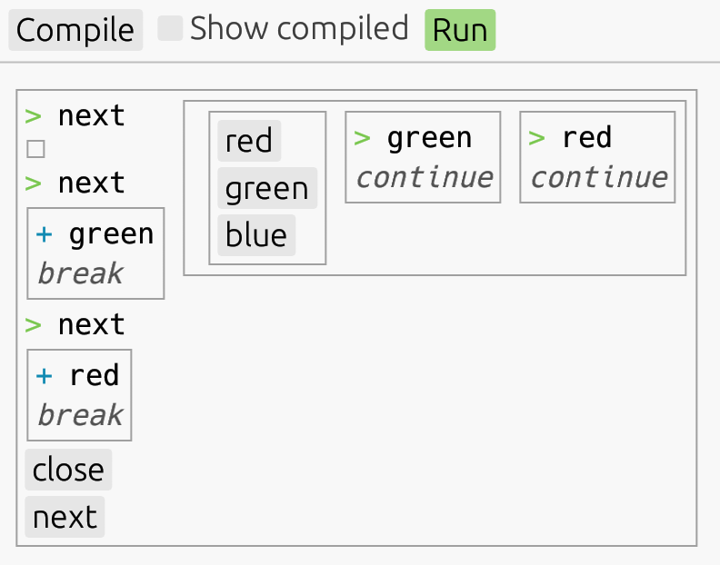

# An experimental concurrent language with an interactive playground


## Setting up

If you don't have Rust and Cargo installed, [do that first](https://doc.rust-lang.org/cargo/getting-started/installation.html). Then clone this repository and execute

```
$ cargo run
```

to open the interactive playground.

# The Par language guide

Par (⅋) is an experimental concurrent programming language. It's an attempt to bring the expressive power
of linear logic into practice.

> 📚 **Don't worry if you don't know anything about logic**, you might have interacted
> with it without knowing anyway. Functional programming is based on intuitionistic logic. Rust's ownership system
> is based on affine logic, which is very similar to linear logic. The only difference between the two is that
> affine logic lets you not use a value, drop it. Turns out this is a crucial difference. As we'll see, disallowing
> this ability lets us build a whole new way of doing concurrency.

Since this is a programming language guide and not a math textbook, we won't be mentioning logic from now on,
until the very last section. **It's not important to know anything about logic to understand the language.**
The value of basing the language on linear logic is that it provides a powerful design guidance.

First off, let's list some **general properties of Par:**

- Code executes in **independent processes.**
- Processes **communicate** with each other **via channels.**
- Every channel has **two end-points, in two different processes.**
- **Two processes share at most one channel.**
- The previous two properties guarantee, that **deadlocks are not possible.**
- **No disconnected, unreachable processes.** If we imagine a graph with processes as nodes, and channels
  as edges, it will always be a single connected tree.

Despite the language being dynamically typed at the moment, the above properties hold. With the exception of
_no unreachable processes_, they also hold statically. **A type system with linear types is on the horizon,**
but I want to fully figure out the semantics first.

**All values in Par are channels.** Processes are intangible, they only exist by
executing, and operating on tangible objects: channels. How can it possibly all be channels?

- **A list?** That's a channel sending all its items in order, then signaling the end.
- **A function?** A channel that receives the function argument, then becomes the result.
- **An infinite stream?** Also a channel! This one will be waiting to receive a signal to either
  produce the next item, or to close.

Some features important for a real-world language are still **missing:**

- Primitive types, like **strings and numbers.** However, Par is expressive enough to enable custom
  representations of numbers, booleans, lists, streams, and so on. Just like λ-calculus, but with channels
  and expressive concurrency.
- **Replicable values.** But, once again, replication can be implemented manually, for now.
- **Non-determinism.** This can't be implemented manually, but I alredy have a mechanism thought out.

One non-essential feature that I really hope will make it into the language later is **reactive values.**
It's those that update automatically based on their dependencies changing.

## Getting started

To get familiar with the interactive playground after opening it, type this code into the editor on the left:

```
define rgb = [value] value {
  red?   => .red!
  green? => .green!
  blue?  => .blue!
}

define stream_of_rgbs = [input] begin {
  close => do {
    input?
  } in !

  next => do {
    input[value]
    let color = rgb(value)
  } in (color) loop
}
```

Don't worry about understanding this code just yet.

Press `Compile` to make the code runnable. Par compiles a high-level language with ergonomic syntactic constructs
into a lower-level process language (which is very close to a subset of the high-level language). If you're interested
in what the compiled code looks like, press `✅ Show compiled`.

Now, press `Run` to open a list of compiled definitions; any one can be run and interacted with.

Running `rgb` prompts a choice of three colors.



After choosing the desired color, it's copied from right to left.



Running `stream_of_rgbs` prompts a choice of `close` or `next`. Every `next` triggers a prompt of a new color.
Notice that you're allowed to request new prompts before the previous ones are resolved. This is a small show
of Par's concurrency in action.



## Program structure

Code in playground consists of a list of definitions. Any of them can be run and interacted with. Each definition
has the form:

```
define <name> = <expression>
```

There are currently no capabilities for external I/O; all interaction occurs within the playground, via its
automatic user interface.

## Process syntax

Par code has two main syntactic categories: **expressions** and **processes**. The process syntax is more general,
but less convenient for many situations. Still, it's needed in others. It's important we
**first understand the process syntax,** because most of the expression syntax can be considered a
_syntax sugar_ on top of the process syntax.

Before we delve into it, there is **one piece of expression syntax we will need.** After all, definitions need an
expression after the `=` sign. The construct is **channel spawning**, and it is a necessary piece of syntax;
not a syntactic sugar. It goes like this:

```
chan <name> { <process> }
```

This together with the process syntax is all we really need for writing Par programs. In fact, that's what the
compiled code comes down to. However, the expression syntax we'll cover afterwards, is a big factor in making Par
code a pleasure to write and read.

Type this code:

```
define program = chan user {
  // nothing yet
}
```

**Here's what it means:**

- The expression `chan user { ... }` **evaluates to a channel,** which we assign to `program`.
- At the same time, the **process** inside the curly braces **is started.**
- Inside it, the **other side of the channel** returned from the expression is made available under the name `user`.

If you press `Compile`, you'll get an error:

```
3| }
   ^
This process must end.
```

Ending a process is explicit in Par. A process that doesn't end is syntactically invalid ― there is no need to
worry about accidentally not doing it.

### Closing channels

