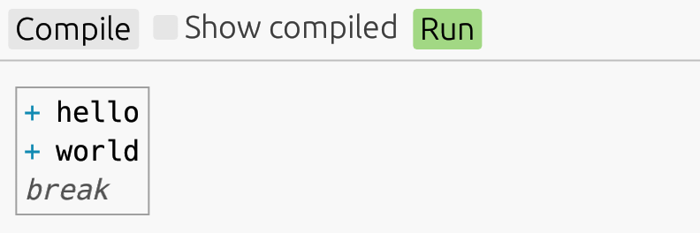
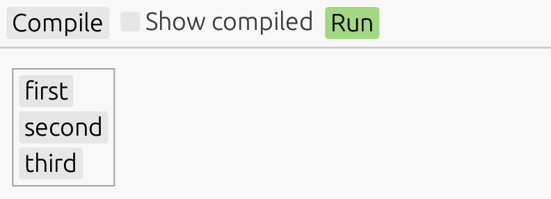
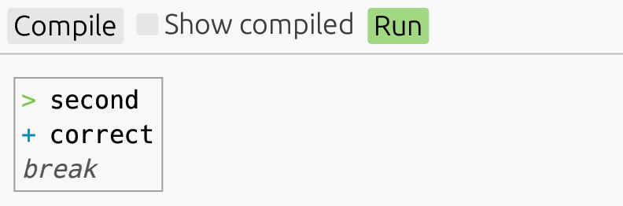
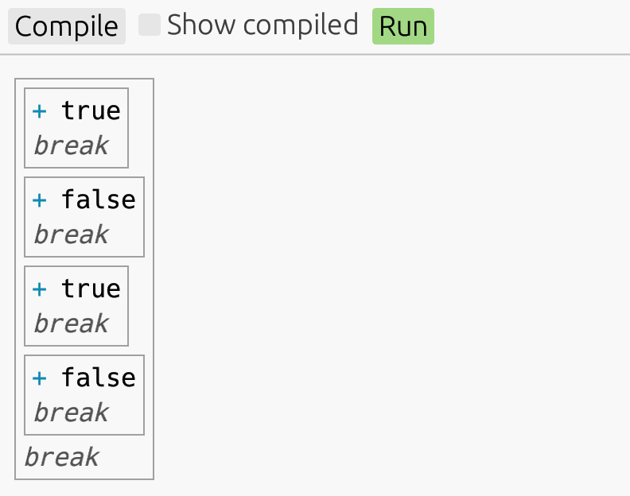
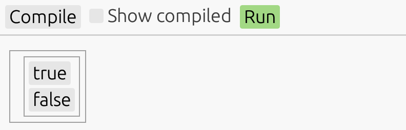
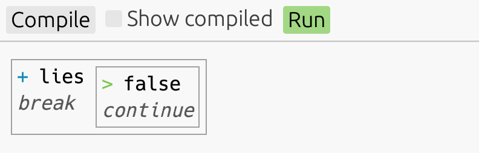
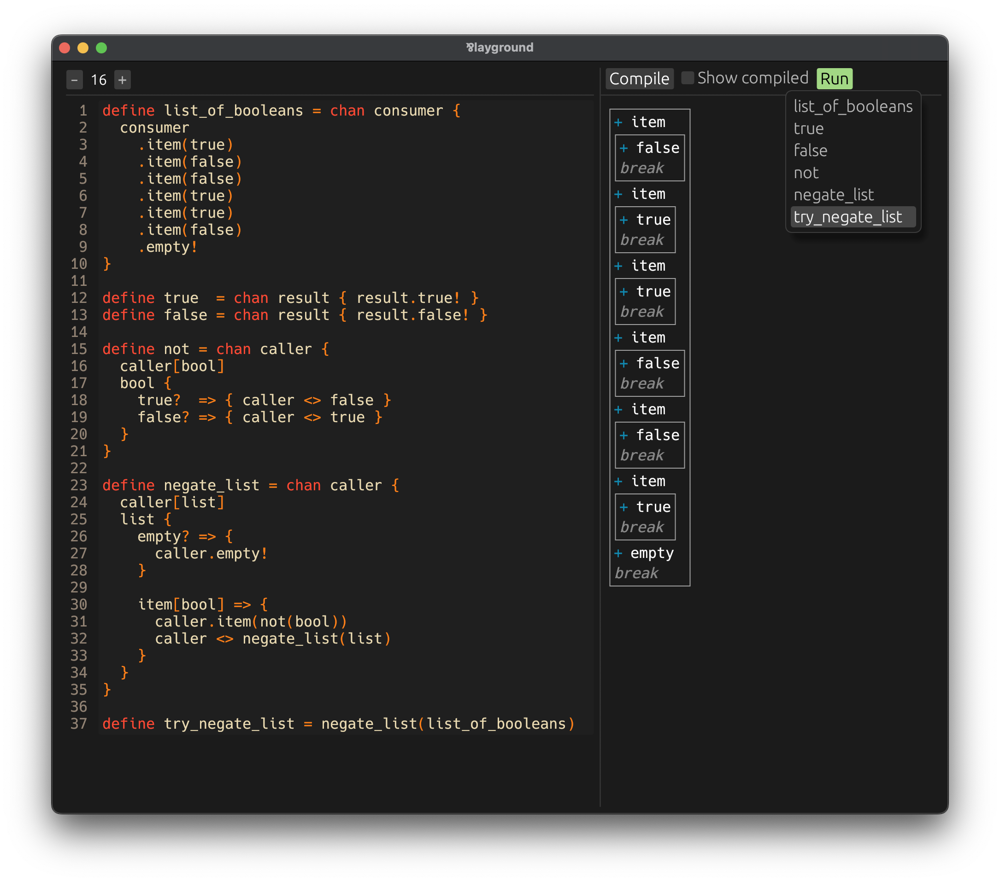

# An experimental concurrent language with an interactive playground


## Setting up

If you don't have Rust and Cargo installed, [do that first](https://doc.rust-lang.org/cargo/getting-started/installation.html). Then clone this repository and execute

```
$ cargo run
```

to open the interactive playground.

# The Par language guide

Par (⅋) is an experimental concurrent programming language. It's an attempt to bring the expressive power
of linear logic into practice.

> 📚 **Don't worry if you don't know anything about logic**, you might have interacted
> with it without knowing anyway. Functional programming is based on intuitionistic logic. Rust's ownership system
> is based on affine logic, which is very similar to linear logic. The only difference between the two is that
> affine logic lets you not use a value, drop it. Turns out this is a crucial difference. As we'll see, disallowing
> this ability lets us build a whole new way of doing concurrency.

Since this is a programming language guide and not a math textbook, we won't be mentioning logic from now on,
until the very last section. **It's not important to know anything about logic to understand the language.**
The value of basing the language on linear logic is that it provides a powerful design guidance.

First off, let's list some **general properties of Par:**

- Code executes in **independent processes.**
- Processes **communicate** with each other **via channels.**
- Every channel has **two end-points, in two different processes.**
- **Two processes share at most one channel.**
- The previous two properties guarantee, that **deadlocks are not possible.**
- **No disconnected, unreachable processes.** If we imagine a graph with processes as nodes, and channels
  as edges, it will always be a single connected tree.

Despite the language being dynamically typed at the moment, the above properties hold. With the exception of
_no unreachable processes_, they also hold statically. **A type system with linear types is on the horizon,**
but I want to fully figure out the semantics first.

**All values in Par are channels.** Processes are intangible, they only exist by
executing, and operating on tangible objects: channels. How can it possibly all be channels?

- **A list?** That's a channel sending all its items in order, then signaling the end.
- **A function?** A channel that receives the function argument, then becomes the result.
- **An infinite stream?** Also a channel! This one will be waiting to receive a signal to either
  produce the next item, or to close.

Some features important for a real-world language are still **missing:**

- Primitive types, like **strings and numbers.** However, Par is expressive enough to enable custom
  representations of numbers, booleans, lists, streams, and so on. Just like λ-calculus, but with channels
  and expressive concurrency.
- **Replicable values.** But, once again, replication can be implemented manually, for now.
- **Non-determinism.** This can't be implemented manually, but I alredy have a mechanism thought out.

One non-essential feature that I really hope will make it into the language later is **reactive values.**
It's those that update automatically based on their dependencies changing.

## Getting started

To get familiar with the interactive playground after opening it, type this code into the editor on the left:

```
define rgb = [value] value {
  red?   => .red!
  green? => .green!
  blue?  => .blue!
}

define stream_of_rgbs = [input] begin {
  close => do {
    input?
  } in !

  next => do {
    input[value]
    let color = rgb(value)
  } in (color) loop
}
```

Don't worry about understanding this code just yet.

Press `Compile` to make the code runnable. Par compiles a high-level language with ergonomic syntactic constructs
into a lower-level process language (which is very close to a subset of the high-level language). If you're interested
in what the compiled code looks like, press `✅ Show compiled`.

Now, press `Run` to open a list of compiled definitions; any one can be run and interacted with.

Running `rgb` prompts a choice of three colors.


After choosing the desired color, it's copied from right to left.


Running `stream_of_rgbs` prompts a choice of `close` or `next`. Every `next` triggers a prompt of a new color.
Notice that you're allowed to request new prompts before the previous ones are resolved. This is a small show
of Par's concurrency in action.


## Program structure

Code in playground consists of a list of definitions. Any of them can be run and interacted with. Each definition
has the form:

```
define <name> = <expression>
```

There are currently no capabilities for external I/O; all interaction occurs within the playground, via its
automatic user interface.

## Process syntax

Par code has two main syntactic categories: **expressions** and **processes**. The process syntax is more general,
but less convenient for many situations. Still, it's needed in others. It's important we
**first understand the process syntax,** because most of the expression syntax can be considered a
_syntax sugar_ on top of the process syntax.

### Channel spawning

Before we delve into it, there is **one piece of expression syntax we will need.** After all, definitions need an
expression after the `=` sign. The construct is channel spawning, and it is a necessary piece of syntax;
not a syntactic sugar. It goes like this:

```
chan <name> { <process> }
```

This together with the process syntax is all we really need for writing Par programs. In fact, that's what the
compiled code comes down to. However, the expression syntax we'll cover afterwards, is a big factor in making Par
code a pleasure to write and read.

Type this code:

```
define program = chan user {
  // nothing yet
}
```

**Here's what it means:**

- The expression `chan user { ... }` **evaluates to a channel,** which we assign to `program`.
- At the same time, the **process** inside the curly braces **is started.**
- Inside it, the **other side of the channel** returned from the expression is made available under the name `user`.

If you press `Compile`, you'll get an error:

```
3| }
   ^
This process must end.
```

Ending a process is explicit in Par. A process that doesn't end is syntactically invalid ― there is no need to
worry about accidentally not doing it.

### Let statement

To assign an expression to a variable inside a process, use:

```
let <name> = <expression>
```

For example:

```
define program = chan user {
  let child = chan parent {
    // nothing yet
  }
  // nothing yet
}
```

Variable names can be reassigned, but only after the original channel was either closed or moved elsewhere.

### Closing channels

To keep processes connected, and make sure no process goes forgotten, closing a channel is different for
each of its sides. One side uses `!`, while the other one must match it with `?`.

- `channel!` **closes** the channel, and **ends the process** at the same time.
- `channel?` **waits** for the channel to be closed from the other side, and **continues its process.**

In other words, **`!` must be the last statement** of a process, while **`?` cannot be the last statement.**

> 📝 I know this may appear as a very strange restriction. But it's important for maintaing the guarantees outlined
> in the beginning. Also, you'll get used it. It actually does end up making a lot of sense.

Type this:

```
define program = chan user {
  user!
}
```

This now compiles and runs.

Note, that since we're running it and thus connecting the channel to the UI, it's the UI that does the `?` part
here. To show how it works across processes, type this:

```
define program = chan user {
  let child = chan parent {
    parent!  // I'm closing...
  }
  child?  // I'm waiting here until you close...
  user!
}
```

The behavior towards the UI stays the same, but inside, we spawn a process, end it while closing its channel
via `parent!`, wait on the other side using `child?`, and only then we close the `user` channel.

### Linearity of channels

What would happen if we didn't close the `child` channel from the parent side?

```
define program = chan user {
  let child = chan parent {
    parent!
  }
  //child?
  user!
}
```

Run it and see!

```
6|   user!
         ^
Cannot end this process without handling `child`.
```

**Channels must not be dropped.** A channel may only be closed in coordination by both of its sides. With a type
system in place, all of this will be checked at compile-time. Right now, failing to coordinate here only results in
runtime errors.

Additionally, **each channel end-point must be in exactly one process.** A channel can be **moved** (captured) into
a newly spawned process, but then can't be acessed from outside anymore. Try this code:

```
define program = chan user {
  let child1 = chan parent { parent! }
  let child2 = chan parent {
    child1?  // captured `child1` here
    parent!
  }
  child1?  // comment this line to avoid crash
  child2?
  user!
}
```

Running it gives this error:

```
7|   child1?  // comment this line to avoid crash
           ^
`child1` is not defined.
```

That's because `child1` was previously moved into another process.

### Signaling

To direct the **control-flow** of processes, we send **signals** across channels. To send a signal, use `.`:

```
channel.signal
```

The name of a signal can be anything: `.close`, `.next`, `.red`, `.item`, `.empty`, and so on, are all examples of
signal names we'll see in this guide.

To receive one of several signals from a channel, use curly braces after the channel's name. Inside the curly
braces, put a branch of the form `signal => { <process> }` for each possible signal:

```
channel {
  signal1 => {
    // do something after `signal1` received
  }
  signal2 => {
    // do something after `signal2` received
  }
  signal3 => {
    // do something after `signal3` received
  }
}
```

After sending or receiving a signal, the original channel is **again available** for further communication.

Sending a signal on a channel handled by the UI prints the signal in the UI.

```
define program = chan user {
  user.hello
  user.world
  user!
}
```



Awaiting a signal on a channel handled by the UI let's the user choose among the options via buttons.

```
define program = chan user {
  user {
    first => {
      user.wrong
      user!
    }
    second => {
      user.correct
      user!
    }
    third => {
      user.wrong
      user!
    }
  }
}
```



After clicking a button:



> 📝 Sending a signal intentionally looks like method invocation from other languages. While the two concepts
> are different, they often serve similar purposes. Aside from that, signals also serve the role of sum types:
> those with multiple alternative forms.

#### Pass

If multiple branches need to continue the same way, use `pass` to resume execution after the curly braces.
This is especially useful when doing multiple choices in a row.

```
define program = chan user {
  user.guess_which
  user {
    first  => { pass }
    second => { user.correct! }
    third  => { pass }
  }
  user.try_again
  user {
    first  => { pass }
    second => { user.correct! }
    third  => { pass }
  }
  user.wrong!
}
```

### Combining operations

I took the liberty to combine operations in the last snippet before explaining it, because otherwise it would be
unbearably long.

Multiple operations on the same channel can be combined into a single statement. For example,
instead of typing:

```
user.correct
user!
```

We can just do:

```
user.correct!
```

Any sequence of operations can be combined this way in the process syntax. The only limitation is that the
choice operation (receiving a signal) can only be the last operation in a sequence. That's because the control-flow
continues inside its branches.

The previous snippet can be made even shorter!

```
define program = chan user {
  user.guess_which {
    first  => { pass }
    second => { user.correct! }
    third  => { pass }
  }
  user.try_again {
    first  => { pass }
    second => { user.correct! }
    third  => { pass }
  }
  user.wrong!
}
```

> 📝 Combining operations in a single statement makes it read like a single, more complex operation. Thanks to the
> succinctness (very little typing) of the basic operations, the compound ones are uncluttered, allowing their
> own meaning to shine forth.

### Exchanging values

Channels can be viewed as **single-use values.** For example, booleans can be implemented as channels sending one
of the signals `.true` or `.false`, and immediately closing afterwards.

```
define true = chan result {
  result.true!
}

define false = chan result {
  result.false!
}
```

Whole channels, thus values, can be sent and received along other channels.

To **send a value** over a channel, use **round parentheses:**

```
define program = chan user {
  user(true)!
}
```

**Definitions can be used multiple times;** each use creates a new instance of the defined value.

```
define program = chan user {
  user(true)
  user(false)
  user(true)(false)!
}
```



A value **sent to the UI** creates a separate box in the UI where the value is shown or interacted with.

To **receive a value** from a channel, use **square brackets** with a name of a **new variable** where
the received value will be assigned.

```
define program = chan user {
  let child = chan parent {
    parent(true)
    parent(false)!
  }

  child[value1]  // creates a new variable `value1`
  child[value2]  // and another variable, `value2`
  child?

  user(value1)(value2)!
}
```

Values can be received from the UI as well. The UI will gladly send channels your way upon request.

```
define program = chan user {
  user[value]

  value {
    true => {
      user.truth
      pass
    }
    false => {
      user.lies
      pass
    }
  }

  value?
  user!
}
```





**Receiving a value from the UI** prompts the UI to create a new box, but unlike with values sent to the UI,
this box will be in a new column.

> 📝 It's important to understand the difference between sending and receiving when it comes to interaction.
> Since any channel sent or received or be used for any kind of communication, the difference may not
> initially be obvious.
>
> A good example is communicating with the UI. If you send a value to the UI, the entire process tree hidden
> behind that channel will no longer be accessible to the program. That's because there is at most one channel
> between any two processes, and by sending that channel, this connection was severed.
>
> Thus, send values that you consider output, those you won't be touching anymore.
>
> If you want to be juggling multiple channels, and make them interact with each other, those channels have to
> be received (or otherwise brought) into the process that wants to juggle them. The UI is willing to send you
> any number of channels, for your program to then juggle and make them interact among each other.

### Combining operations on branches

Operations of **receiving a value** (`[...]`) and **waiting for a channel to close** (`?`) can be appended
directly after a signal name on a branch. They will be applied to the same channel that we received the signal
from.

```
channel {
  signal => {
    channel[value]
    channel?
    ...
  }
}
```

This verbose code can be rewritten more consisely:

```
channel {
  signal[value]? => {
    ...
  }
}
```

Some combination of these two operations often come right after receiving a signal, so this shortcut can be handy.
If it looks somewhat like pattern matching from other languages, that's because it does, and is used in
similar situations. However, it's not full pattern matching, the patterns can't nest. For now, at least.

### Implementing functions

Of course, functions will be made from channels, but what is the right way? The obvious idea is probably:
send a value to it, receive an answer. For example, the boolean negation could be implemented in this method
like this:

```
define not = chan caller {
  caller[bool]
  bool {
    true?  => { caller(false)! }
    false? => { caller(true)! }
  }
}
```

And used like this:

```
define program = chan user {
  let function = not
  function(true)[result]?
  user(result)!
}
```

But that's wasting a good channel. The **idiomatic approach** is different: after receiving its argument, the
channel should **become the result**. Here's how that looks for the `not` function:

```
define not = chan caller {
  caller[bool]
  bool {
    true?  => { caller.false! }
    false? => { caller.true! }
  }
}

define program = chan user {
  let negation = not
  negation(true)  // `negation` becomes `false` after this
  user(negation)!
}
```

But there's an objection! In the definition of `not`, we don't make use of the previous definitions of
`true` and `false` for returning. What if we were dealing with more complex values? We wouldn't want to
be manually recreating them on the `caller` channel every time.

To solve that, we need _linking_.

#### Early sugar treat: function calling in expression syntax

It's not expression syntax time yet, but let's be honest, three lines to call a function is a lot.

```
  let negation = not
  negation(true)
  user(negation)!
```

There is one piece of expression syntax that we'll thus learn early: sending in application position.
Using it, the above can be rewritten as simply:

```
  user(not(true))!
```

Looks exactly like calling a function in other languages!

In general, this verbose function calling in process syntax

```
let call = function
call(argument)
let result = call
```

can be rewritten to

```
let result = function(argument)
```

And `function(argument)` can not only be assigned to a variable, but also used wherever an expression is
expected, such as sending values, or definitions.

> 📝 Note, that this only makes sense if the function channel becomes its result after receiving the
> argument. If the channel was to send the result back separately, we'd have to receive it using
> `[...]`.

### Linking

We can link two channels, which **forwards their communication to one another,** in both directions.
A visual may help:

```
<Process X>   <Process Y>   <Process Z>
    A+ <------> A-   B+ <------> B-
```

Suppose there are three processes: X, Y, and Z. X and Y share two ends of the same channel (A+ and A-), and
Y and Z share two ends of another channel (B+ and B-).

In this situation, the process Y can decide to **link** the channels A- and B+. What we get is this:

```
<Process X>                 <Process Z>
    A+ <-----------------------> B-
```

The process Y disappears, together with its channels A- and B+, and the processes X and Z are now in direct
communication with one another. Anything X does on A+ is now reflected on B- and vice versa.

Using linking, we can finally use the definitions of `true` and `false` when definiting `not`. The
linking operator is `<>`:

```
define true  = chan result { result.true! }
define false = chan result { result.false! }

define not = chan caller {
  caller[bool]
  bool {
    true?  => { caller <> false }
    false? => { caller <> true }
  }
}
```

**Linking must be the last statement** in a process, just as is it the case with `!`.

### Recursion, the usual way

Par has an own powerful construct for doing recursion called `begin`/`loop`, which we cover in the next
section. It doesn't require explicit self-reference, but **recursion by self-reference** is supported (for now,
at least), and it's best we cover it first.

Suppose we want to negate a list of booleans. The first question is, how do we make a list?

A list will be a channel that either will keep sending either a signal `.item` followed by sending the actual
item, or sends a signal `.empty` and ends. Here's an example list of booleans:

```
define list_of_booleans = chan consumer {
  consumer
    .item(true)
    .item(false)
    .item(false)
    .item(true)
    .item(true)
    .item(false)
    .empty!
}
```

Now we want to write a function that will take any such list and return a list with each boolean negated.
Since we want it to work on a list of any length, we'll need recursion.

```
define negate_list = chan caller {
  caller[list]
  list {
    empty? => {
      caller.empty!
    }

    item[bool] => {
      caller.item(not(bool))
      caller <> negate_list(list)
    }
  }
}
```

We're using the expression syntax for function calls. However, we could've written the last lines equivalently
as:

```
      let rest = negate_list
      rest(list)
      caller <> rest
```

Let's break this down.

```
  caller[list]
```

After receiving the input list, the task is now to construct the output list on the `caller` channel.

```
    empty? => {
      caller.empty!
    }
```

If the original list is empty, we signal an empty list on the output too.

```
    item[bool] => {
      caller.item(not(bool))
      caller <> negate_list(list)
    }
```

For the non-empty case, we immediately receive an item on the branch. Then we send it negated to the
output.

Finally, we start computing the negation of the rest of the list, sending the original `list` variable
(which is now one item shorter) to a recursive call. Since we want the rest of the output to go to the
original `caller`, we link this new tail with it.

**Three things to note:**

1. The way we construct lists is very similar to the generator/yield syntax from other languages. Par
   doesn't need a special syntax for this purpose thanks to its expressive concurrent syntax and
   semantics.
2. "Tail-call optimization" naturally follows from the semantics. There is no call-stack in Par,
   only processes and channels. After invoking the recursive call, the original process doesn't wait
   for it to finish. It proceeds immediately to the next statement: linking. It links the two channels
   and ends. Thus, the transformation will consume constant memory.
3. On the consumer side, items will be available as soon as they are produced. Multiple list transformations
   can be stacked and proceed in parallel. This is, once again, a natural consequence of the concurrent semantics.

The only thing left is to run it:

```
define try_negate_list = negate_list(list_of_booleans)
```



### Recursion, a better way

Par introduces a way to do recursion "in-line", **without an explicit self-reference.** This is very
expressive: for example, passing anonymous recursive functions as arguments is simple. Also,
helper functions for encapsulating a recursive loop, which are usually needed with recursion by
self-reference, are not needed in Par.

It's fascilitated by two keywords: **`begin` and `loop`.**

```
<channel> begin
```

**`begin` establishes a _loop point_.** The channel name it's applied to is bound as a _loop driver_. It's not
modified in any way.

Later, **`loop` goes back to the loop point.**

```
<channel> loop
```

When executing `loop`, two things happen:

1. The channel `loop` is applied to becomes the new driver. All it means operationally is it's assigned to the
   original driver name bound in `begin`.
2. Control-flow jumps to the associated _loop point_.

Let's make it clear by rewriting `negate_list`.

```
define negate_list = chan caller {
  caller[list]
  list begin {  // loop point established here
    empty? => {
      caller.empty!
    }

    item[bool] => {
      caller.item(not(bool))
      list loop  // go back to the loop point
    }
  }
}
```

Just like `!`, and `<>`, **`loop` must be the last statement** in a process.

Conceptually, _the driver_ should be the value you're looping on, that's **getting shorter with each iteration.**

> 📝 In the case of `negate_list`, the driver remains the same channel, so specifying it may seem redundant. But
> in other cases, the name may be different. Later in the examples, there is a function for flattening binary
> trees, which replaces the driver with a different channel, two times.
>
> There are two main reasons for doing it this way:
>
> 1. It enables consistent `begin`/`loop` in expression syntax, where the driver may be anonymous.
> 2. It opens doors to checking for totality (no infinite loops). All that type system needs to check is
>    that the new driver in `loop` is a descendant of the original driver in `begin`.

Notice, that the loop uses the channel `caller` from the enclosing process.
**Variables used between `begin` and `loop` persist across cycles.** All you need to make sure is that all
of those variables are still assigned (with possibly different values) before entering `loop`.

**`loop` may be used from nested processes, too!** The following example may be a little mind-bending at first,
but it's useful. It's one of many possible implementations of reversing a list. What makes it special is that
it demonstrates a nice traversal pattern usable for other data structures, too.

```
define reverse = chan caller {
  caller[list]

  let caller = chan return {
    list begin {
      empty? => {
        return <> caller
      }

      item[value] => {
        let caller = chan return { list loop }
        caller.item(value)
        return <> caller
      }
    }
  }

  caller.empty!
}
```

This `reverse` sling-shots the `caller` channel all the way to the end of the list, creating a string of
processes connected by the `return` channels. Then, from the end, it calls `.item(value)` for each item
in the list, sending the `caller` back up the `return` channels, all the way. Eventually, the outer-most
`return` is reached, and `.empty!` is sent on the channel.

```
        let caller = chan return { list loop }
```

Here it's important to understand that `loop` captures the original `caller` variable, moving it into this
new process. That's why we re-assign `caller` after getting it back. The other variable used in the loop body,
`return`, is created anew every time.
